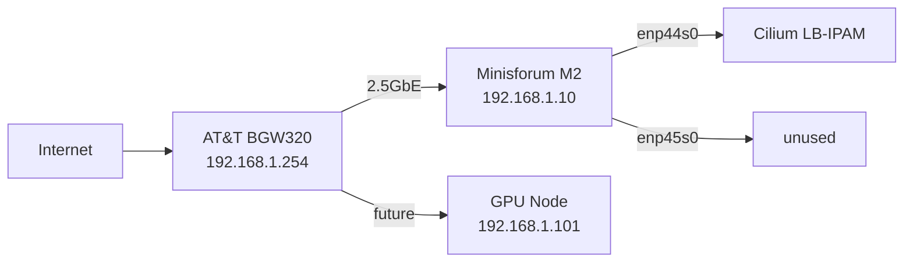

# Networking

## Physical Topology



## Cilium LB-IPAM

Cilium provides LoadBalancer services via L2 ARP advertisement. When a `Service type: LoadBalancer` is created, Cilium assigns an IP from the pool and responds to ARP requests on the node's physical interface.

**IP Pool**: `192.168.1.11–30` (defined in `ipaddresspool.yaml`)

```yaml
apiVersion: cilium.io/v2alpha1
kind: CiliumLoadBalancerIPPool
metadata:
  name: homelab-pool
spec:
  blocks:
    - start: "192.168.1.11"
      stop: "192.168.1.30"
```

## DNS Resolution

### Local (homelab-dns)
CoreDNS runs as `homelab-dns` at `192.168.1.22`, serving the `.homelab` zone:

| Domain | IP |
|--------|-----|
| jellyfin.homelab | 192.168.1.11 |
| budget.homelab | 192.168.1.12 |
| grafana.homelab | 192.168.1.13 |
| argocd.homelab | 192.168.1.14 |
| apitable.homelab | 192.168.1.15 |
| ha.homelab | 192.168.1.16 |
| ocis.homelab | 192.168.1.20 |

### Remote (Tailscale Split DNS)
Tailscale MagicDNS is configured with a split DNS override for `.homelab` → `192.168.1.10`. Remote devices on Tailscale resolve `*.homelab` through the cluster's CoreDNS.

## Tailscale VPN

The Tailscale operator runs in the cluster, providing:
- Remote access to all services via `*.homelab` domains
- Subnet routing for `192.168.1.0/24`

### DERP Relay Status

Current connectivity uses **DERP relay (SFO)** with ~12ms latency because the AT&T BGW320 doesn't support UPnP/NAT-PMP for automatic port mapping.

**To enable direct connections**: Forward UDP port 41641 on the BGW320 to 192.168.1.10.

| Path | Method | Latency |
|------|--------|---------|
| Mac → K8s | DERP (sfo) | ~12ms |
| Mac → iPhone | Direct (IPv6) | ~2ms |

## TLS Termination

nginx-ingress at `192.168.1.21` handles TLS termination for all `*.homelab` services. Certificates are issued by cert-manager using the `homelab-ca` ClusterIssuer (see [PKI](./pki)).
