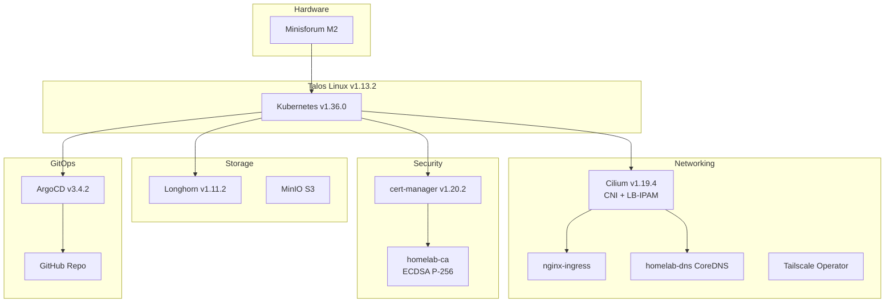

# Architecture Overview

## Hardware

**Minisforum M2** — compact mini PC running the entire stack:
- CPU: AMD Ryzen (8 cores)
- RAM: 32GB DDR5
- Storage: 1TB NVMe
- NICs: 2× 2.5GbE (enp44s0 active, enp45s0 spare)

## Software Stack



## Design Decisions

### Why Talos Linux?
- **Immutable OS**: No SSH, no shell — all config via API
- **Minimal attack surface**: No package manager, no user accounts
- **Declarative**: Machine config is version-controlled YAML
- **Automatic updates**: `talosctl upgrade` with zero downtime

### Why Single-Node?
- Cost-effective for personal use
- Longhorn still provides volume snapshots (just 1 replica)
- ArgoCD handles declarative state — rebuild from scratch in minutes
- GPU node (192.168.1.101) available for future expansion

### Why ArgoCD App-of-Apps?
All applications are defined as ArgoCD `Application` resources in `app-of-apps/`. A single root Application watches this directory and deploys everything:

```yaml
# ArgoCD watches app-of-apps/ with directory.recurse: true
# Each subdirectory contains an Application manifest
# Changes pushed to GitHub → ArgoCD auto-syncs
```

### Why Cilium over MetalLB?
- Cilium replaces kube-proxy, CNI, and LoadBalancer in one component
- LB-IPAM provides L2 ARP-based VIP advertisement (same as MetalLB L2)
- Single IP pool: `192.168.1.11-30`
- No separate MetalLB deployment needed
