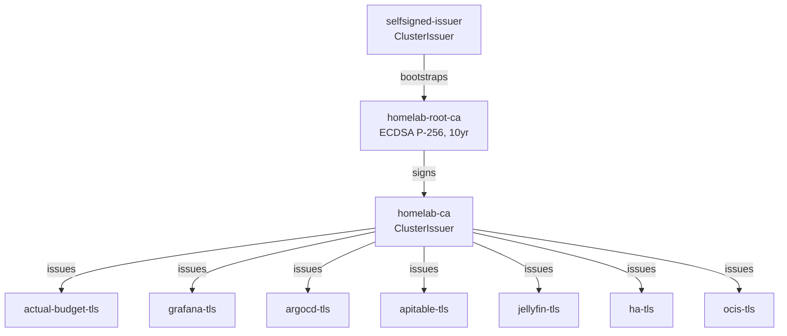

# PKI & TLS Certificates

## Architecture



## How It Works

1. **cert-manager v1.20.2** watches for `Certificate` resources
2. Each service has a `Certificate` CR requesting a TLS cert from `homelab-ca`
3. Certs are 1 year, auto-renewed 30 days before expiry
4. Private keys use ECDSA P-256 (fast, small, modern)
5. nginx-ingress reads the resulting `tls.crt`/`tls.key` from Secrets

## Trust the Root CA

To get browser-trusted HTTPS without warnings, install the root CA on your devices:

```bash
# Extract the root CA certificate
kubectl get secret homelab-root-ca -n cert-manager \
  -o jsonpath='{.data.tls\.crt}' | base64 -d > homelab-ca.crt

# macOS — add to system keychain
security add-trusted-cert -d -r trustRoot \
  -k /Library/Keychains/System.keychain homelab-ca.crt

# iOS — AirDrop the .crt file, install via Settings → Profile
# Then: Settings → General → About → Certificate Trust Settings → Enable
```

## Check Certificate Status

```bash
# List all certificates
kubectl get certificates -A

# Check a specific cert
kubectl describe certificate grafana-tls -n grafana-prod

# View cert details
kubectl get secret grafana-tls -n grafana-prod \
  -o jsonpath='{.data.tls\.crt}' | base64 -d | openssl x509 -text -noout
```
