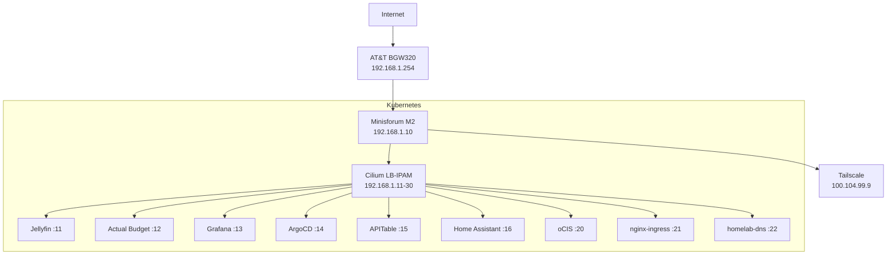

# Homelab Documentation

Single-node Kubernetes homelab running **Talos Linux v1.13.2** on a Minisforum M2, managed by **ArgoCD** with GitOps.

## Quick Reference

| Component | Version | Purpose |
|-----------|---------|---------|
| Talos Linux | v1.13.2 | Immutable K8s OS |
| Kubernetes | v1.36.0 | Container orchestration |
| Cilium | v1.19.4 | CNI + LoadBalancer (LB-IPAM) |
| ArgoCD | v3.4.2 | GitOps CD |
| Longhorn | v1.11.2 | Distributed storage |
| cert-manager | v1.20.2 | TLS certificate automation |

## Service Map



## IP Assignments

| IP | Service | Domain |
|----|---------|--------|
| 192.168.1.10 | Minisforum M2 (node) | — |
| 192.168.1.11 | Jellyfin | jellyfin.homelab |
| 192.168.1.12 | Actual Budget | budget.homelab |
| 192.168.1.13 | Grafana | grafana.homelab |
| 192.168.1.14 | ArgoCD | argocd.homelab |
| 192.168.1.15 | APITable | apitable.homelab |
| 192.168.1.16 | Home Assistant | ha.homelab |
| 192.168.1.20 | oCIS | ocis.homelab |
| 192.168.1.21 | nginx-ingress | *.homelab |
| 192.168.1.22 | homelab-dns | — |

## Repository Layout

```
homelab/
├── app-of-apps/          # ArgoCD Application manifests
├── infrastructure/       # Cluster infra (cert-manager, Longhorn, etc.)
├── dashboard/            # Next.js 3D dashboard
├── docs/                 # Raw markdown docs
├── docs-site/            # Docusaurus docs site (you are here)
├── prometheus-monitoring/ # kube-prometheus-stack
└── simplefin-exporter/   # Financial metrics
```
