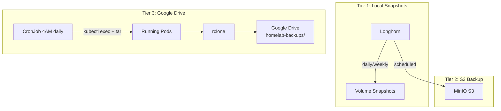

# Backup Strategy

## Overview



## Tier 1: Longhorn Snapshots

Local point-in-time recovery. Protects against accidental deletion but NOT disk failure.

| Job | Schedule | Retain |
|-----|----------|--------|
| Daily | 2 AM | 7 days |
| Weekly | 3 AM Sunday | 4 weeks |

## Tier 2: Longhorn → MinIO S3

Longhorn backups to MinIO running in the `backup` namespace. Provides a second copy on-cluster.

## Tier 3: Google Drive (Offsite)

A CronJob runs at **4 AM daily** using `rclone/rclone:1.74.2`:

1. Init container downloads `kubectl` binary
2. Main container uses `kubectl exec + tar` to extract data from pods in other namespaces
3. Uploads to `google_drive:homelab-backups/<timestamp>/`
4. Prunes backups older than 7 days

### What's Backed Up

| Service | Data | Size |
|---------|------|------|
| Actual Budget | `/data` | ~9 MB |
| Grafana | `/var/lib/grafana` | ~21 MB |
| Jellyfin | `/config` | ~56 KB |
| Home Assistant | `/config` | ~760 KB |

### RBAC

The backup job uses a dedicated `ServiceAccount` with a `ClusterRole` granting:
- `pods` — get, list
- `pods/exec` — create

### Manual Trigger

```bash
kubectl create job --from=cronjob/gdrive-backup manual-backup-$(date +%s) -n backup
```

### Restore

```bash
# List backups
rclone ls google_drive:homelab-backups/

# Download a backup
rclone copy google_drive:homelab-backups/2026-05-28T04:00:00/ ./restore/

# Restore to pod
kubectl cp ./restore/actual-budget.tar.gz actual-budget-prod/actual-budget-xxx:/tmp/
kubectl exec -n actual-budget-prod actual-budget-xxx -- tar xzf /tmp/actual-budget.tar.gz -C /data
```
