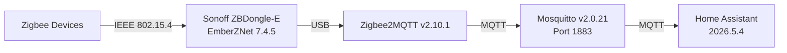

# Home Automation

## Home Assistant

| Property | Value |
|----------|-------|
| Version | 2026.5.4 |
| Namespace | `ha-prod` |
| IP | 192.168.1.16 |
| Domain | ha.homelab |

### Zigbee Stack

### Components

| Component | Version | Purpose |
|-----------|---------|---------|
| Home Assistant | 2026.5.4 | Automation hub |
| Zigbee2MQTT | 2.10.1 | Zigbee bridge |
| Mosquitto | 2.0.21 | MQTT broker |
| Sonoff ZBDongle-E | EmberZNet 7.4.5 | Zigbee coordinator |

### MQTT Configuration

Mosquitto runs with anonymous authentication on port 1883 (ClusterIP only — not exposed outside the cluster). This is acceptable for a single-node homelab with no external network access.

## Backup

Home Assistant config is included in the Google Drive backup cronjob. The backup extracts the configuration directory from the running pod.
